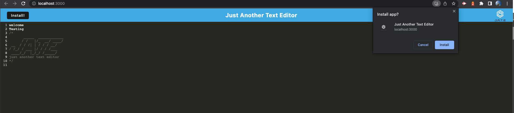
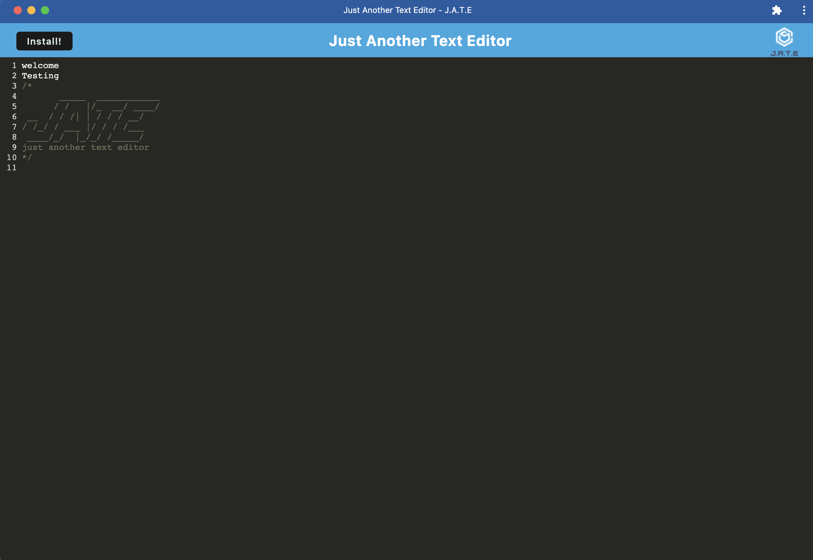

# pwa-textEditor
Just Another Text Editor. JATE 
A Progressive Web Application
# About
 A text editor that runs in the browser. The app is a single-page application that meets the PWA criteria. It also features a number of data persistence techniques that serve as redundancy in case one of the options is not supported by the browser. The application can also function offline.
# Installation
To use this application the user will run `npm run start` from the root directory

# Description
This is an installable text editor web application that contains a client server folder structure. It uses webpack to bundle JS files. It is able to function with past and present generations of JS without error. The editor uses Indexed DB for storage on the client for any data entered in. This data will persist without an internet connection.

# Mock-up
The following image shows the applications functionality and appearance. 

Running in the browser 

 
 
Installed on the machine 

# Links

## Github Repo
https://github.com/KyleKarotko/pwa-textEditor/
## Deployed (heroku) application link
https://desolate-thicket-86948.herokuapp.com/